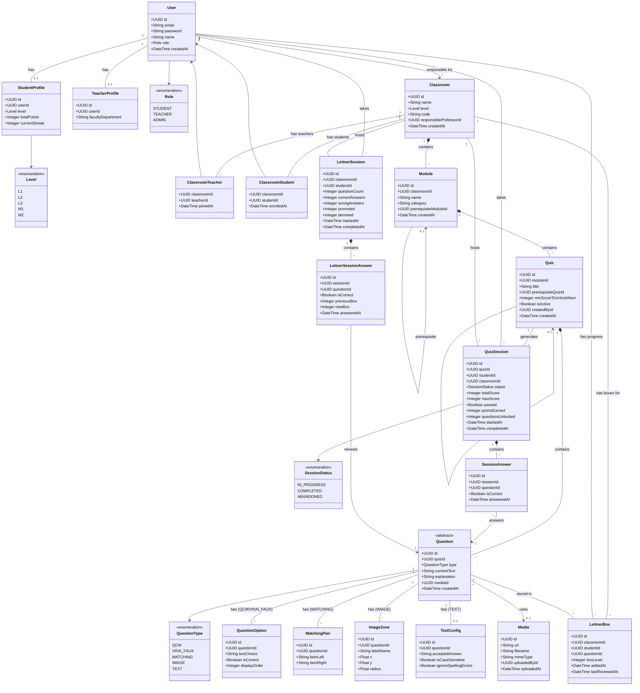
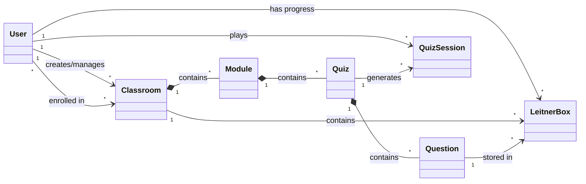
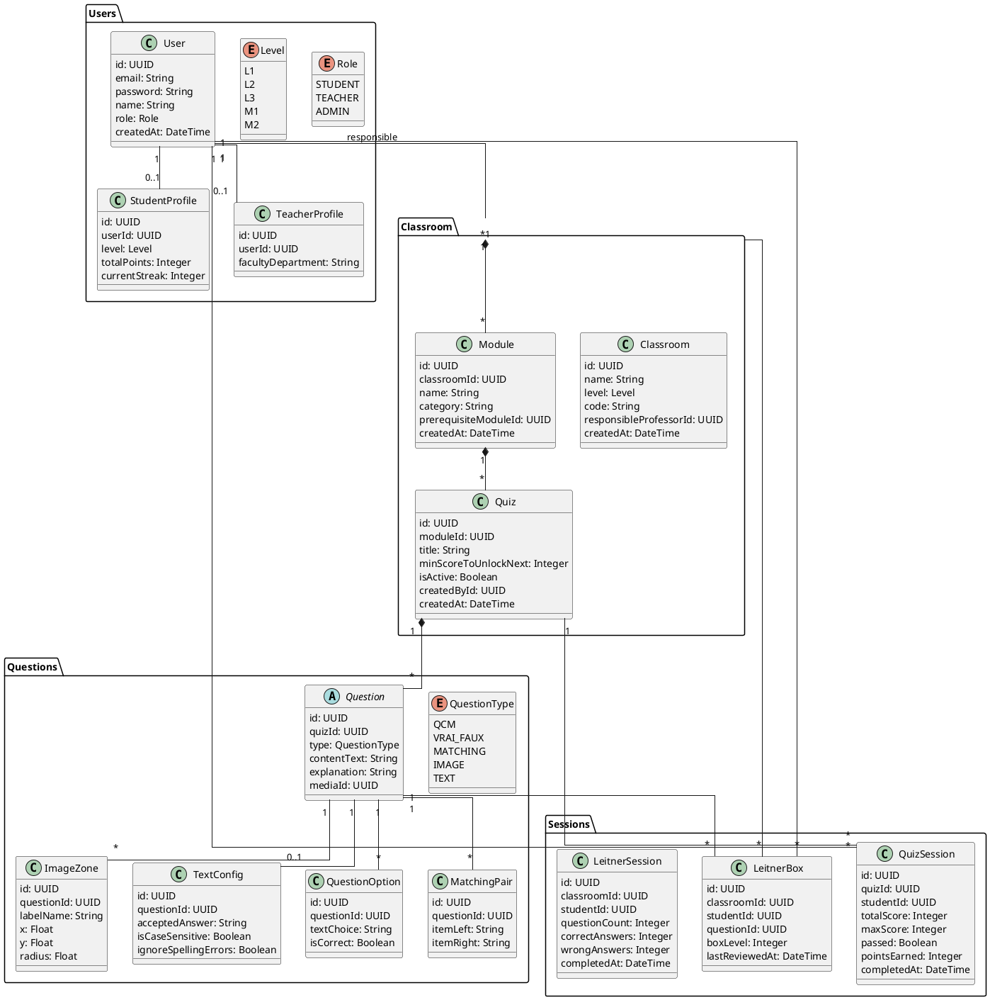

# Diagramme de Classes - Duobingo

Ce document présente le diagramme de classes UML du projet Duobingo basé sur les DTOs et la structure API.

---

## Diagramme Principal (Mermaid)



---

## Diagramme Simplifié (Vue d'ensemble)



---

## Description des Entités

### Utilisateurs

| Entité | Description |
|--------|-------------|
| **User** | Utilisateur du système (étudiant, professeur ou admin) |
| **StudentProfile** | Profil spécifique aux étudiants (niveau, points, streak) |
| **TeacherProfile** | Profil spécifique aux professeurs (département) |

### Structure Pédagogique

| Entité | Description |
|--------|-------------|
| **Classroom** | Cours/classe - conteneur principal géré par un prof responsable |
| **ClassroomTeacher** | Table de liaison - enseignants associés à un cours |
| **ClassroomStudent** | Table de liaison - étudiants inscrits à un cours |
| **Module** | Module thématique au sein d'un cours (peut avoir un prérequis) |
| **Quiz** | Quiz/examen au sein d'un module (peut avoir un quiz prérequis) |
| **CompletedModule** | Marqueur simple : module complété par un étudiant (pour débloquer les modules suivants) |
| **CompletedQuiz** | Marqueur simple : quiz réussi par un étudiant (pour vérifier les déblocages) |

### Questions

| Entité | Description |
|--------|-------------|
| **Question** | Question abstraite (polymorphisme via QuestionType) |
| **QuestionOption** | Option de réponse pour QCM/VRAI_FAUX |
| **MatchingPair** | Paire d'appariement pour MATCHING |
| **ImageZone** | Zone cliquable sur image pour IMAGE |
| **TextConfig** | Configuration de réponse textuelle pour TEXT |
| **Media** | Fichier média (image) associé aux questions |

### Sessions de Jeu

| Entité | Description |
|--------|-------------|
| **QuizSession** | Session de jeu d'un quiz par un étudiant |
| **SessionAnswer** | Réponse donnée pendant une session |

### Système Leitner

| Entité | Description |
|--------|-------------|
| **LeitnerBox** | Position d'une question dans les boîtes Leitner d'un étudiant pour un cours |
| **LeitnerSession** | Session de révision Leitner (statistiques agrégées) |
| **LeitnerSessionAnswer** | Détail d'une réponse durant une session Leitner (pour review) |

---

## Relations Clés

### Hiérarchie de Contenu
```
Classroom (1) ──contains──> (*) Module (1) ──contains──> (*) Quiz (1) ──contains──> (*) Question
```

### Gestion des Permissions
```
User (Prof Responsable) ──creates──> Classroom
Classroom ──has teachers──> User (via ClassroomTeacher)
Classroom ──has students──> User (via ClassroomStudent)
```

### Progression Étudiant
```
User (Student) ──takes──> QuizSession ──for──> Quiz
User (Student) ──has──> LeitnerBox ──in──> Classroom
LeitnerBox ──contains──> Question (avec boxLevel 1-5)
```

### Prérequis
```
Module ──prerequisite──> Module (self-reference optionnelle)
Quiz.minScoreToUnlockNext détermine si le quiz suivant est accessible
```

---

## Notes d'Implémentation

### Polymorphisme des Questions

Le champ `type` dans `Question` détermine quelles tables de détail sont utilisées :

| Type | Tables associées |
|------|------------------|
| `QCM` | QuestionOption (multiple, 1+ correctes) |
| `VRAI_FAUX` | QuestionOption (exactement 2) |
| `MATCHING` | MatchingPair |
| `IMAGE` | ImageZone + Media |
| `TEXT` | TextConfig |

### Tables de Liaison

Les relations many-to-many utilisent des tables intermédiaires :

- `ClassroomTeacher` : Classroom ↔ User (professeurs)
- `ClassroomStudent` : Classroom ↔ User (étudiants)
- `LeitnerBox` : Classroom ↔ User ↔ Question (avec boxLevel)

### Cascade de Suppression

```
DELETE Classroom → DELETE Modules → DELETE Quizzes → DELETE Questions
                                  → DELETE CompletedModule
                                  → DELETE CompletedQuiz
                → DELETE ClassroomTeachers
                → DELETE ClassroomStudents
                → DELETE LeitnerBoxes
                → DELETE LeitnerSessions → DELETE LeitnerSessionAnswers
                → DELETE QuizSessions → DELETE SessionAnswers

DELETE Module → DELETE CompletedModule (pour ce module)
DELETE Quiz → DELETE CompletedQuiz (pour ce quiz)

DELETE Media → ÉCHEC si utilisé par une Question (contrainte FK)

DELETE Student → DELETE CompletedModule + CompletedQuiz + LeitnerBox (redémarrage complet)
```

**Principe** : 
- `CompletedModule` et `CompletedQuiz` sont les seules tables de cache
- Permettent des vérifications de déblocage instantanées (index sur PK)
- Tout le reste (stats, scores) est calculé dynamiquement depuis `QuizSession`

---

## Diagramme PlantUML (Alternative)



---

## Visualisation

Pour visualiser ces diagrammes :

1. **Mermaid** : Copier le code dans [Mermaid Live Editor](https://mermaid.live/)
2. **PlantUML** : Copier le code dans [PlantUML Online](https://www.plantuml.com/plantuml/)
3. **VS Code** : Installer l'extension "Markdown Preview Mermaid Support" ou "PlantUML"
